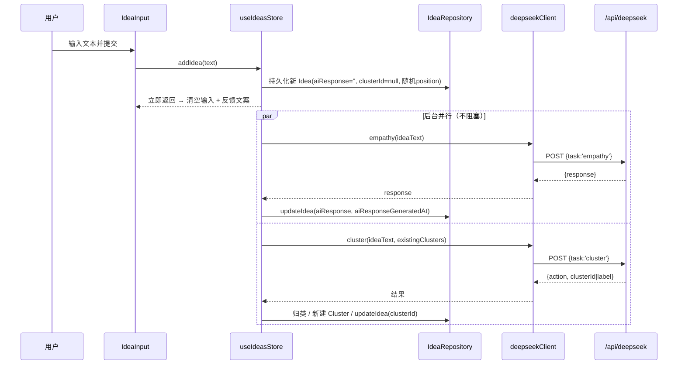

# Dormia — 技术设计文档（TDD）

版本：v0.1（MVP）
关联文档：[PRD.md](../PRD.md)
最后更新：2026-07-05

> 本文档用于指导 Dormia MVP 阶段的技术开发，落地 [PRD.md](../PRD.md) 中定义的产品需求。所有技术决策以「不破坏产品情绪基调、为未来云端迁移预留空间」为前提。

---

## 1. 概述与设计原则

Dormia 是一个「没有期待、没有观众、没有产出义务」的想法容器。技术实现必须服务于这个基调，而不是把它做成又一个效率工具。

### 1.1 工程层面的设计原则

1. **静默优先**：所有 AI 相关的后台动作（共情回应、聚类）都异步执行，绝不阻塞用户输入，绝不在前台出现「生成中 / loading」等待态。
2. **失败不打扰**：AI 调用失败时静默降级（保留想法本体，回应可为空、颜色用默认色），不弹错误提示。
3. **存储可迁移**：业务逻辑依赖存储接口而非 `localStorage` 实现，未来切换到云端（Neon Postgres）时不改业务代码。
4. **数据不写死聚类方式**：数据结构上把「分组结果」与「分组算法」解耦，方案 1（LLM 打标）与方案 2（embedding）可互换。
5. **极简分层**：UI 层不直接访问存储或网络，统一经 `store → repository / ai client`。
6. **克制的视觉与文案**：暗色蓝紫、弥散光晕、缓慢柔和动效；文案冷静克制，集中管理，禁止鼓励式措辞。

### 1.2 非目标（对齐 PRD）

不做登录、多端同步、社交、搜索、时间排序列表、任务型提醒。MVP 仅供产品负责人本人在单一浏览器使用。

---

## 2. 技术栈与选型理由

| 层 | 选型 | 理由 |
|---|---|---|
| 构建工具 | Vite | 启动快、原生 ESM、TS 开箱即用，与 React 配合成熟 |
| 前端框架 | React 18 + TypeScript | 组件化清晰、生态成熟、Canvas/SVG 动画库丰富 |
| 状态管理 | Zustand | 轻量、样板少、适合单人 MVP，避免 Redux 的仪式感 |
| 样式 | CSS Modules + CSS 变量（设计令牌） | 自定义光晕/动效自由度高，主题令牌集中管理，无额外运行时 |
| 路由 | 无第三方路由（自维护两页状态）或 `react-router` 极简用法 | 仅两页，避免过度工程；用一个 `view` 状态切换即可 |
| 动画 | Canvas 2D（深处光晕）+ SVG/CSS（首页线条呼吸） | 光晕节点数量可控、Canvas 性能好；线条动画用 SVG 更易做有机曲线 |
| 后端代理 | Vercel Serverless Function（`api/deepseek.ts`） | 隐藏 API Key、部署简单、天然为未来云端 API 铺路 |
| AI | DeepSeek Chat Completions | PRD 指定；仅有对话补全接口（无 embedding），聚类走方案 1 |
| 数据存储 | localStorage（经抽象层封装） | MVP 阶段无需后端数据库，抽象层保证可迁移 |
| 可选增强 | PWA（`vite-plugin-pwa`） | 「类 App」全屏体验，加分项非必须 |

> 说明：`react-router` 与自维护 `view` 状态二选一，建议 MVP 直接用一个顶层 `view: 'home' | 'depths'` 状态切换页面，配合切换动效实现「轻量入口」，不引入路由依赖。

---

## 3. 目录结构

```
dormia/
├── api/
│   └── deepseek.ts              # Serverless 代理：隐藏 Key，服务端构造 Prompt
├── src/
│   ├── main.tsx                 # 应用入口
│   ├── App.tsx                  # 顶层：view 切换 + 页面切换动效
│   ├── pages/
│   │   ├── HomePage.tsx         # 首页（输入）
│   │   └── DepthsPage.tsx       # 深处（档案）
│   ├── components/
│   │   ├── BreathingLines.tsx   # 首页顶部线条呼吸动画（SVG）
│   │   ├── IdeaInput.tsx        # 输入框 + 提交
│   │   ├── FeedbackToast.tsx    # 提交后一句反馈文案
│   │   ├── GlowCanvas.tsx       # 深处光晕节点画布（Canvas）
│   │   ├── IdeaDetailCard.tsx   # 想法详情卡片（原文/回应/编辑/删除）
│   │   └── ViewSwitcher.tsx     # 两页之间的轻量切换入口
│   ├── store/
│   │   └── useIdeasStore.ts     # Zustand：ideas / clusters / actions
│   ├── data/
│   │   ├── types.ts             # Idea / Cluster 类型
│   │   ├── StorageAdapter.ts    # 存储接口（抽象）
│   │   ├── LocalStorageAdapter.ts # localStorage 实现
│   │   └── IdeaRepository.ts    # 业务读写门面，依赖 StorageAdapter
│   ├── ai/
│   │   ├── deepseekClient.ts    # 调用 /api/deepseek
│   │   ├── empathy.ts           # 共情回应
│   │   ├── clustering.ts        # LLM 打标聚类（方案 1）
│   │   └── prompts.ts           # Prompt 模板（前端可留副本，主体在服务端）
│   ├── lib/
│   │   ├── id.ts                # id 生成（crypto.randomUUID）
│   │   ├── position.ts          # 随机散布坐标生成
│   │   └── palette.ts           # 聚类颜色分配
│   ├── content/
│   │   └── copy.ts              # 所有系统文案常量（冷静克制语气）
│   ├── styles/
│   │   ├── tokens.css           # 设计令牌（颜色/间距/动效时长）
│   │   └── global.css           # 全局样式
│   └── config.ts                # 环境相关常量
├── .env.example                 # DEEPSEEK_API_KEY=（示例，不含真值）
├── index.html
├── vite.config.ts
├── tsconfig.json
└── package.json
```

---

## 4. 数据模型

对齐 [PRD 第 8 节](../PRD.md)。字段设计考虑未来平滑迁移到云端数据库。

```ts
// src/data/types.ts

export interface Position {
  x: number; // 0~1 归一化坐标，渲染时乘画布尺寸，避免不同屏幕位置错乱
  y: number;
}

export interface Idea {
  id: string;                       // crypto.randomUUID()
  text: string;                     // 想法原文
  createdAt: number;                // epoch ms
  updatedAt: number;                // epoch ms
  clusterId: string | null;         // 所属分组，AI 未就绪时为 null
  aiResponse: string;               // AI 共情回应（一句话），未就绪时为空串
  aiResponseGeneratedAt: number | null;
  position: Position;               // 深处页固定散布坐标
}

export interface Cluster {
  id: string;
  label: string;                    // AI 内部标签，不展示给用户
  color: string;                    // 节点光晕着色（来自 palette）
  createdAt: number;
}

// 持久化整体结构（便于一次读写与版本迁移）
export interface DormiaState {
  version: number;                  // schema 版本，迁移用
  ideas: Idea[];
  clusters: Cluster[];
}
```

> 关于坐标：采用 `0~1` 归一化存储，而非绝对像素，这样在缩放/不同视口下位置稳定（满足 AC-4「刷新后位置不变」）。

---

## 5. 存储抽象层

业务层只依赖 `StorageAdapter` 接口，`localStorage` 只是其中一个实现。未来迁移到 Neon Postgres 只需新增 `RemoteAdapter` 实现同一接口。

```ts
// src/data/StorageAdapter.ts
import type { DormiaState } from './types';

export interface StorageAdapter {
  load(): Promise<DormiaState>;      // 返回全量状态；首次为空初始态
  save(state: DormiaState): Promise<void>;
}
```

```ts
// src/data/LocalStorageAdapter.ts
import type { StorageAdapter } from './StorageAdapter';
import type { DormiaState } from './types';

const KEY = 'dormia.state.v1';
const EMPTY: DormiaState = { version: 1, ideas: [], clusters: [] };

export class LocalStorageAdapter implements StorageAdapter {
  async load(): Promise<DormiaState> {
    try {
      const raw = localStorage.getItem(KEY);
      if (!raw) return structuredClone(EMPTY);
      return JSON.parse(raw) as DormiaState;
    } catch {
      return structuredClone(EMPTY); // 解析失败不抛错，回退空态
    }
  }

  async save(state: DormiaState): Promise<void> {
    localStorage.setItem(KEY, JSON.stringify(state));
  }
}
```

`IdeaRepository` 是业务门面，封装增删改查与「原子读改写」：

```ts
// src/data/IdeaRepository.ts（示意）
export class IdeaRepository {
  constructor(private adapter: StorageAdapter) {}

  async getAll(): Promise<DormiaState> { return this.adapter.load(); }

  async addIdea(idea: Idea): Promise<void> { /* load → push → save */ }
  async updateIdea(id: string, patch: Partial<Idea>): Promise<void> { /* ... */ }
  async removeIdea(id: string): Promise<void> { /* ... */ }
  async upsertCluster(cluster: Cluster): Promise<void> { /* ... */ }
}
```

### 迁移策略
- 所有异步接口（`Promise`）从第一天起就用 `async`，即便 `localStorage` 是同步的——这样切换到网络实现时接口签名不变。
- `DormiaState.version` 用于将来的 schema 迁移；`load()` 内可加版本升级逻辑。
- 业务层与 `store` 永远只 import `IdeaRepository`，不直接碰 `localStorage`。

---

## 6. 后端代理设计（`/api/deepseek`）

目的：隐藏 `DEEPSEEK_API_KEY`，并把 Prompt 主体保留在服务端，避免前端暴露 Key 或被当作通用 LLM 滥用。

### 6.1 接口约定

`POST /api/deepseek`

请求体（任务式，前端只传数据，不传完整 Prompt）：

```ts
type DeepSeekRequest =
  | { task: 'empathy'; ideaText: string }
  | {
      task: 'cluster';
      ideaText: string;
      existingClusters: { id: string; label: string }[];
    };
```

响应体：

```ts
// empathy
type EmpathyResponse = { response: string };

// cluster
type ClusterResponse = {
  action: 'existing' | 'new';
  clusterId?: string;   // action=existing 时返回命中的 id
  label?: string;       // action=new 时返回新分组的简短标签
};
```

### 6.2 服务端职责
1. 读取环境变量 `DEEPSEEK_API_KEY`（不进代码库，配置在部署平台）。
2. 按 `task` 选择对应 system prompt（见第 7 节），拼装 messages。
3. 调用 DeepSeek Chat Completions（`temperature` 依任务设定：共情稍高、聚类偏低且 `response_format: json`）。
4. 解析结果，抽取纯净字段返回给前端。
5. 错误处理：DeepSeek 异常时返回非 2xx，前端负责静默降级。

### 6.3 错误与重试
- 服务端不做重试，快速失败返回。
- 前端 `deepseekClient` 可做一次轻量重试（针对网络抖动），失败即降级。
- 超时：前端请求设 10s 超时；超时按失败处理。

---

## 7. AI 能力设计

两类能力均在想法提交后**静默异步**触发，用户查看详情时内容已就绪（满足 AC-3）。

### 7.1 共情回应（empathy）

- **触发**：想法提交后立即触发；编辑想法文字后重新触发（满足 AC-6）。
- **约束**：仅一句话；不含建议、不含行动号召、不含鼓励词。
- **降级**：失败时 `aiResponse` 保持空串，详情卡片对空回应做安静留白处理，不显示报错。

Prompt 设计（服务端）：

```
System:
你是 Dormia 的「深处」。用户会把一个闪现的念头交给你。
你的任务：只用一句中文短句，安静地「看见」这个念头背后的情绪或意图，并温和地命名它。

严格规则：
- 只输出一句话，不分段、不换行、不加引号。
- 不给建议，不问「你打算怎么做」。
- 不鼓励、不评价、不夸奖（禁止出现「加油」「你可以的」「很棒」等）。
- 不复述原文，而是回应它的情绪或渴望。
- 语气：克制、安静、像深夜里轻声的回应。

示例：
念头：做一个关于公平正义的系统
回应：关于秩序的渴望，被听见了。

User:
{{ideaText}}
```

参数建议：`temperature: 0.8`，`max_tokens` 较小（一句话）。

### 7.2 语义聚类打标（cluster，方案 1）

- **触发**：每次新想法提交后，对**该新想法**做增量归类（将其与已有分组标签比较）。
  - PRD 6.4.2 提到「对全部想法重新聚类」，但方案 1 推荐增量打标：只判断新想法归入已有分组还是新建分组，成本低、效果贴近「AI 自由归类」，满足 AC-8。全量重聚类作为后续可选优化。
- **编辑后**：建议重新触发归类（保持一致性）。
- **降级**：失败时 `clusterId` 保持 `null`，节点使用默认光晕色，不影响记录本体。

Prompt 设计（服务端）：

```
System:
你在为一批「念头」做语义分组，帮助把语气/主题相近的念头归到一起。
给你：一个新念头，以及已有分组的标签列表（可能为空）。
判断这个新念头应归入某个已有分组，还是需要一个新分组。

严格以 JSON 返回，不要多余文字：
- 归入已有：{"action":"existing","clusterId":"<命中的id>"}
- 需要新建：{"action":"new","label":"<不超过4字的简短中文标签>"}

规则：
- 标签仅用于内部分组着色，不会展示给用户，务求简短。
- 不设预定义分类体系，完全按语义自由判断。
- 拿不准时倾向归入最接近的已有分组，避免分组碎片化。

User:
新念头：{{ideaText}}
已有分组：{{existingClusters JSON: [{id,label}...]}}
```

参数建议：`temperature: 0.2`，`response_format: { type: 'json_object' }`。

前端处理（`clustering.ts`）：
- `action='existing'` → 用返回 `clusterId` 更新想法。
- `action='new'` → 生成新 `Cluster`（`id`、`label`、从 `palette` 取下一个颜色），写入并把想法指向它。

### 7.3 颜色分配（`lib/palette.ts`）
- 预置一组低饱和蓝紫冷色系色板（对齐视觉基调）。
- 新分组按序取色，超出后按色相环偏移生成，保证同分组同色、跨分组可区分且不刺眼。

---

## 8. 前端模块设计

### 8.1 顶层与页面切换（`App.tsx`）
- 维护 `view: 'home' | 'depths'`。
- `ViewSwitcher` 提供轻量入口（顶部图标或滑动手势），文案避免「返回/新建」这类任务型语言。
- 切换用缓慢柔和的过渡（淡入淡出/轻微位移），禁止弹跳、快速缩放。

### 8.2 首页（`HomePage` + `BreathingLines` + `IdeaInput` + `FeedbackToast`）
- 上半部：`BreathingLines`——SVG 有机曲线的呼吸式动效，持续轻微运动，传达平静非等待。用 `requestAnimationFrame` 或 CSS 动画驱动，动效缓慢。
- 下半部：`IdeaInput`——纯文本输入，无「新建」按钮，无空状态引导。回车或点击提交，无二次确认。
- 提交流程见第 9 节；提交后 `FeedbackToast` 显示 `copy.submitSuccess`（「它已安静地沉入深处。」）后输入框清空。

### 8.3 深处页（`DepthsPage` + `GlowCanvas` + `IdeaDetailCard`）
- `GlowCanvas`：Canvas 2D 渲染所有想法为光晕节点。
  - 坐标：`position(0~1)` × 画布尺寸。
  - 节点大小：可随文字长度或新旧程度做**细微**差异（非强数据可视化）。
  - 着色：按 `clusterId` 找 `Cluster.color`；无分组用默认色。
  - 交互：支持缩放/平移浏览；点击命中节点 → 打开 `IdeaDetailCard`。
  - 入场：新想法有缓慢下沉/扩散动效。
- `IdeaDetailCard`：展示原文、AI 一句回应、编辑入口、删除入口。
  - 编辑：修改文字保存 → 重新触发共情回应与归类。
  - 删除：无严肃警告措辞，用 `copy.deleteHint`（「它将不再被记起。」），永久删除不做回收站。
- 空状态：无内容时显示 `copy.emptyDepths`（「这里还很安静。」）。

### 8.4 状态管理（`useIdeasStore.ts`）
Zustand store 持有 `ideas`、`clusters` 及动作：`init`（启动时 load）、`addIdea`、`updateIdea`、`removeIdea`。所有动作内部调用 `IdeaRepository` 持久化，并在 AI 结果返回后再次更新。UI 组件订阅 store，不直接触碰存储/网络。

---

## 9. 提交想法数据流（静默异步）



关键点：
- 步骤在 `addIdea` 返回后立即让 UI 清空并显示反馈，AI 部分为 fire-and-forget。
- 任一 AI 分支失败 → 静默降级，不影响另一分支与想法本体。

---

## 10. 文案与视觉令牌

### 10.1 文案集中管理（`content/copy.ts`）

```ts
export const copy = {
  submitSuccess: '它已安静地沉入深处。',
  emptyDepths: '这里还很安静。',
  deleteHint: '它将不再被记起。',
  inputPlaceholder: '……', // 保持轻量克制，避免引导式提示
} as const;
```

所有面向用户的文字必须来自此文件，遵循冷静、克制、不评判、不鼓励行动的语气。

### 10.2 设计令牌（`styles/tokens.css`）
- 背景：暗色（深蓝紫近黑）。
- 光晕：低饱和蓝紫（misty diffuse glow）。
- 动效时长：偏长（如 600ms~1200ms），缓动曲线柔和（ease-in-out，避免 bounce）。
- 间距：留白充足；字体简洁。
- 禁止：高饱和撞色、进度条、勋章、彩带等激励型元素（满足 AC-9）。

---

## 11. 开发方案与里程碑

| 里程碑 | 目标 | 主要产出 |
|---|---|---|
| M0 脚手架 | 工程可运行 | Vite + React + TS 初始化；`tsconfig`/ESLint/Prettier；目录结构；`tokens.css` 暗色基调；`.env.example` |
| M1 记录闭环 | 首页可记录并持久化 | `IdeaInput`、`FeedbackToast`；`StorageAdapter`/`LocalStorageAdapter`/`IdeaRepository`；`useIdeasStore`；满足 AC-1、AC-2、AC-10 |
| M2 深处可视化 | 想法以光晕节点呈现 | `GlowCanvas`（随机固定坐标、缩放/平移）、`IdeaDetailCard`（查看/编辑/删除）、`ViewSwitcher`、空状态；满足 AC-4、AC-5、AC-7 |
| M3 AI 接入 | 共情回应 + 聚类着色 | `api/deepseek.ts` 代理；`deepseekClient`/`empathy`/`clustering`/`prompts`；`palette`；静默异步接线；满足 AC-3、AC-6、AC-8 |
| M4 打磨/PWA | 视觉与动效收尾 | `BreathingLines` 呼吸动画、下沉入场动效、页面切换动效、文案复核；可选 PWA；满足 AC-9 |

> 建议按里程碑顺序推进，每个里程碑结束对照下方验收表自测。

---

## 12. 验收对照表（映射 PRD AC-1~AC-10）

| AC | 场景 | 实现要点 | 覆盖里程碑 |
|---|---|---|---|
| AC-1 | 打开即输入 | `HomePage` 默认渲染 `IdeaInput`，无「新建」按钮 | M1 |
| AC-2 | 提交反馈 | 提交后 `FeedbackToast` 显示 `copy.submitSuccess`，输入框清空 | M1 |
| AC-3 | 后台生成不阻塞 | `addIdea` 立即返回，AI fire-and-forget，无 loading 态 | M3 |
| AC-4 | 深处节点随机且稳定 | `position` 归一化固定存储，刷新不变 | M2 |
| AC-5 | 详情与回应 | `IdeaDetailCard` 展示原文 + 一句回应；Prompt 禁建议/鼓励 | M2 + M3 |
| AC-6 | 编辑重生成 | 编辑保存后重新触发 empathy + cluster | M3 |
| AC-7 | 删除不可恢复 | `removeIdea` 永久删除，无回收站 | M2 |
| AC-8 | 聚类着色更新 | 新增后归类回填 `clusterId`，节点按 `Cluster.color` 着色 | M3 |
| AC-9 | 视觉基调 | 令牌约束 + 无激励型视觉元素 | M4 |
| AC-10 | 数据持久化 | `LocalStorageAdapter` 全量落盘，含回应/分组 | M1 |

---

## 13. 后续演进（预留点，非本期开发）

- **账号与云端存储**：新增实现 `StorageAdapter` 的 `RemoteAdapter`（对接 Neon Postgres via API），业务层零改动。
- **聚类方案 2**：引入独立 embedding 服务 + 向量聚类，替换 `clustering.ts`，数据结构不变。
- **分享能力**：基于云端存储后再评估，MVP 不做。
- **节点视觉随时间演化**：越「老」的想法光晕越柔和等细节，作为迭代点。
